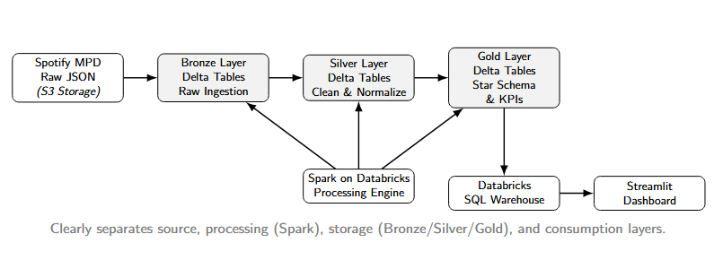
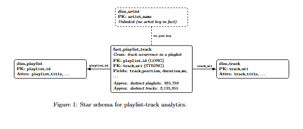

# Big Data Analytics Project — Spotify Million Playlist Dataset (MPD)

**End-to-End Big Data Architecture, Analytics Platform & Recommendation System**

---

## 1. Project Description

This repository contains a complete, production-style big data analytics platform built on the **Spotify Million Playlist Dataset (MPD)**.  
The project implements a scalable data engineering pipeline, analytical data warehouse, interactive dashboard, and a bonus recommendation system.

The primary focus of this work is not only analytics, but also:

- Real-world cloud constraints handling  
- Scalable architecture design  
- Data governance and reliability  
- Deployment-ready engineering practices  

---

## 2. Dataset Overview

**Dataset:** Spotify Million Playlist Dataset (MPD)

**Key characteristics:**

- ~1,000,000 playlists  
- ~2.2 million unique tracks  
- ~295,860 unique artists  
- Tens of millions of playlist–track interactions after normalization  

**Storage details:**

- Original ZIP size: ~5.5 GB  
- Uncompressed size: ~32–34 GB  
- 1000 multi-line JSON files  

Due to Databricks Free Edition limitations, the dataset was:

- Unzipped externally  
- Uploaded once to Amazon S3 as immutable raw data  
- Read directly by Spark using multiline JSON ingestion  

---

## 3. System Architecture (End-to-End)


The project follows a **Medallion Architecture** that clearly separates
data ingestion, processing, storage, and consumption layers.



**Architecture highlights:**
- **Source**: Spotify Million Playlist Dataset (raw JSON stored on Amazon S3)
- **Processing**: Apache Spark running on Databricks
- **Storage**: Delta Lake tables organized as Bronze, Silver, and Gold layers
- **Consumption**: Databricks SQL Warehouse serving a Streamlit dashboard

This design minimizes recomputation, improves reliability, and enables
both analytics and machine learning workloads on the same data foundation.


This architecture ensures:

- Scalability for large datasets  
- Minimal recomputation  
- Clear governance boundaries  
- Reuse of analytics data for ML  

---

## 4. Gold Layer Star Schema

The Gold layer is modeled using a **star schema** optimized for large-scale
playlist–track analytics.



**Schema design details:**
- **Fact table**: `fact_playlist_track`
  - Grain: one track occurrence in a playlist
  - Keys: `playlist_id`, `track_uri`, `track_position`
  - Measures: `track_position`, `duration_ms`
- **Dimensions**:
  - `dim_playlist`: playlist metadata and attributes
  - `dim_track`: track identifiers and titles
  - `dim_artist`: artist-level information

The artist dimension is intentionally **unlinked** from the fact table to
avoid expensive joins and improve performance at scale.

The schema minimizes join complexity, supports aggregation-heavy analytics, and enables machine learning use cases without redesign.

---

## 5. Data Processing Pipeline

### Phase 1 — Data Storage, Cleaning & EDA
- Ingest raw JSON from S3 into Bronze Delta tables  
- Flatten nested playlist and track structures  
- Clean invalid records and duplicates  
- Perform exploratory data analysis  

### Phase 2 — Analytical Modeling
- Design and implement the Gold-layer star schema  
- Persist fact and dimension tables  
- Validate referential integrity  

### Phase 3 — Optimization & Governance
- Persist Silver and Gold tables to avoid recomputation  
- Handle Databricks rate limits and credit exhaustion  
- Secure access using IAM roles and access tokens  
- Serve analytics via Databricks SQL Warehouse  

---

## 6. Dashboard

A production-style **Streamlit dashboard** is deployed and publicly accessible.

🔗 **Dashboard URL:**  
https://bigdata-spotify-mpd-hcvgyjweudpvaqiubgrkrd.streamlit.app/

**Dashboard characteristics:**

- Self-explanatory storytelling design  
- General-to-specific analytical flow  
- Read-only access to Gold tables  
- Optimized for Databricks Free Edition constraints  

**Main sections:**

- Executive Overview & KPIs  
- Data Health Monitoring  
- Playlist-Level Analysis  
- Content Analysis  
- User Engagement Insights  
- Creator-Level Insights  

---

## 7. Bonus: Playlist Continuation Recommender

An optional playlist continuation recommender system is implemented on top of the Gold layer.

🔗 **Recommender system  URL:**  
https://spotify-playlist-recommender.streamlit.app/ 

**Key features:**

- Reuses the existing star schema  
- Popularity-based baseline model  
- Item-to-item co-occurrence model  
- Evaluation using ranking metrics:
  - Precision@K  
  - Recall@K  
  - NDCG@K  

This demonstrates a seamless transition from analytics to machine learning.

---

## 8. Containerization & Deployment

All components are fully containerized.

**Deployment artifacts:**

- `Dockerfile`  
- `docker-compose.yml`  

**Benefits:**

- One-command startup  
- Environment consistency  
- Easy local or cloud deployment  

---

## 9. CI/CD Pipeline

A GitHub Actions CI/CD pipeline is provided to:

- Build Docker images  
- Validate configurations  
- Support automated deployment workflows  

---

## 10. Repository Structure

```
.
├── Backend/                Backend services and data access logic
├── Frontend/               Streamlit dashboard
├── Documentation/          Reports, diagrams, presentations
├── data/                   Configuration and metadata
├── docker-compose.yml      Service orchestration
├── Dockerfile              Container definition
├── .github/workflows/      CI/CD pipelines
├── README.md               Project documentation
└── LICENSE
```

---

## 11. Authors

- **Tasneem Muhammad**  
- **Nada Nabil**  
- **Rghda Salah**  

---

## 12. Acknowledgments

- **Spotify Research** for providing the Million Playlist Dataset (MPD)
- **Databricks** for the unified analytics and Spark execution platform
- **Amazon Web Services (AWS S3)** for reliable object storage used to host
  the full uncompressed Spotify MPD raw JSON dataset and enable scalable
  cloud-based ingestion

---
